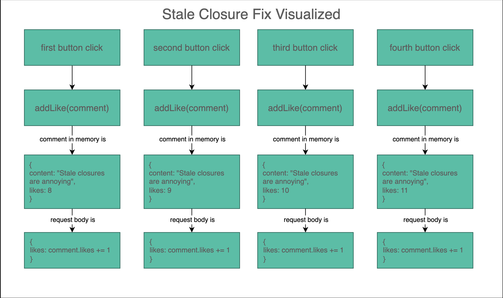

---

theme : "night"
transition: "slide"
highlightTheme: "monokai"
slideNumber: false
title: "06_patch_delete"

---

## PATCH & DELETE Requests

---

## Lecture Goals

- Review how to send a PATCH request using HTML forms and JavaScript
- Review how to send a DELETE request using HTML buttons and JavaScript
- Explain the difference between optimistic and pessimistic rendering

<aside class="notes">
</aside>

---


<aside class="notes">
- not sending anything in body, not expecting anything in body <br />
- Q&A: how is json-server going to know what to delete?
</aside>

---


<aside class="notes">
- very similar to POST <br />
- what are we doing differently with DOM for PATCH vs POST? (for PATCH we aren't creating any new elements) <br />
- we could also just rebuild whole page (refetch everything) after PATCH
</aside>

---


<aside class="notes">
</aside>

---

#### An Example
Run

```
cd 06_PATCH_and_DELETE_Requests/assets
json-server --watch db.json
```

<pre><code data-line-numbers>const commentList = document.querySelector('#comments');
document.querySelector('#refreshList').addEventListener('click', refreshList);
function refreshList() {
  commentList.innerHTML = "";
  fetch('http://localhost:3000/comments')
    .then(res => res.json())
    .then(comments => {
      comments.forEach(renderComment)
    })
}

function renderComment(comment) {
  const li = document.createElement('li');
  li.dataset.commentId = comment.id;
  li.textContent = `${comment.body} `;
  const likeBtn = document.createElement('button');
  likeBtn.textContent = likeButtonTextFor(comment);
  li.append(likeBtn);
  likeBtn.addEventListener('click', (e) => addLike(comment));
  commentList.append(li);
}

function addLike(comment) {
  fetch(`http://localhost:3000/comments/${comment.id}`, {
    method: "PATCH",
    headers: {
      "Content-Type": "application/json"
    },
    body: JSON.stringify({likes: comment.likes + 1})
  })
    .then(res => res.json())
    .then(comment => {
      const btn = document.querySelector(`#comments li[data-comment-id="${comment.id}"] button`);
      btn.textContent = likeButtonTextFor(comment);
    })
}

function likeButtonTextFor(comment) {
  return `${comment.likes} like${comment.likes === 1 ? '' : 's'} `
} </code></pre>

<button id="refreshList">Click to Refresh List</button>
<ul id="comments">

</ul>

<script>
const commentList = document.querySelector('#comments');
document.querySelector('#refreshList').addEventListener('click', refreshList);
function refreshList() {
  commentList.innerHTML = "";
  fetch('http://localhost:3000/comments')
    .then(res => res.json())
    .then(comments => {
      comments.forEach(renderComment)
    })
}

function renderComment(comment) {
  const li = document.createElement('li');
  li.dataset.commentId = comment.id;
  li.textContent = `${comment.body} `;
  const likeBtn = document.createElement('button');
  likeBtn.textContent = likeButtonTextFor(comment);
  li.append(likeBtn);
  likeBtn.addEventListener('click', (e) => addLike(comment));
  commentList.append(li);
}

function addLike(comment) {
  fetch(`http://localhost:3000/comments/${comment.id}`, {
    method: "PATCH",
    headers: {
      "Content-Type": "application/json"
    },
    body: JSON.stringify({likes: comment.likes + 1})
  })
    .then(res => res.json())
    .then(comment => {
      const btn = document.querySelector(`#comments li[data-comment-id="${comment.id}"] button`);
      btn.textContent = likeButtonTextFor(comment);
    })
}

function likeButtonTextFor(comment) {
  return `${comment.likes} like${comment.likes === 1 ? '' : 's'} `
}

</script>

<aside class="notes">
- cd into assets to get working and start json-server <br />
- due to (stale) closures, buttons only work once <br />
- See MDN: "closure is combo of a fxn bundled (enclosed) with references to is surrounding state (lexical environment) <br />
- closure gives inner fxn access to outer scope <br />
- when dealing with async, don't know exactly when fxns are called but they will be called later <br />
- addLike cb is referencing the comment variable in function scope of renderComment -> the closure surrounding comment allows addLike to run with same comment object -> that object's likes is always at 22 and we never update it to the incremented number <br />
- comment object is now stale, it has not been updated; comment.likes + 1 does not set comment.likes (do comment.likes += 1, this will update in database and in closure)
</aside>

---

## Fixing Closure Issues



<aside class="notes">
- when updating, update in db.json AND update in browser <br />
</aside>

---

## Let's Code 🐒

### 1. updating a store using the store form
### 2. delete a book
### 3. update the inventory for a book 

<aside class="notes">
- new: <br />
- editStoreBtn (button), storeEditMode (toggles to say whether store form is for new store or edit store) <br />
- populateStoreEditForm(store), fillIn(form, data): helper functions to fill in form <br />
- events.js: toggleStoreForm, hideStoreForm, showStoreForm: contains additional logic to update global variables determining new or edit state
</aside>