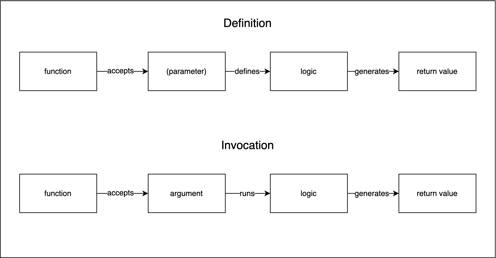

---

theme : "night"
transition: "slide"
highlightTheme: "monokai"
slideNumber: false
title: "01_function_scope"

---

# Functions and Scope

---

#### Guidelines

  

    
<iframe src='https://gfycat.com/ifr/SafeGloriousIslandcanary' frameborder='0' scrolling='no' width='100%' height='100%' style='position:absolute;top:0;left:0;' allowfullscreen></iframe>

 <a href="https://gfycat.com/safegloriousislandcanary-international-man-of-mystery-austin-powers">via Gfycat</a>

  

  

  - The more you participate the more you learn! 
  - 🤯 The moment you are confused, raise your hand. You're not alone! {.fragment}
  - "I don't know" is OK. Guessing is also OK! Mistakes => Learning! {.fragment}
  - 📷 on 🙏 {.fragment}
  

---

#### Coding Along (not required!)

  

    <iframe src="https://giphy.com/embed/VTc0g9IKEpLAk" width="480" height="480" frameBorder="0" class="giphy-embed" allowFullScreen></iframe>
<a href="https://giphy.com/gifs/funny-everyone-VTc0g9IKEpLAk">via GIPHY</a>

  

  

  - it can help
  - it can also hurt 😬 {.fragment}
  - If you get stuck, take a screenshot and refocus on our discussion {.fragment}
  - 💡Everything is recorded! {.fragment}
  - Focus on high level understanding > implementation {.fragment}
  - Comfort solving errors and fixing bugs will come with practice and experience {.fragment}
  

---

### My Setup

##### VSCode extensions:

Extension | Description |
---------|----------|
[Draw.io Integation](https://marketplace.visualstudio.com/items?itemName=hediet.vscode-drawio) | for making diagrams from within VSCode 
[Live Server](https://marketplace.visualstudio.com/items?itemName=ritwickdey.LiveServer) | for opening a webpage in the browser that will reload when the code is saved 
[vscode-reveal](https://marketplace.visualstudio.com/items?itemName=evilz.vscode-reveal) | for opening the slide.md files in the browser to display slideshows
[Tabnine AI Autocomplete](https://marketplace.visualstudio.com/items?itemName=TabNine.tabnine-vscode) | for code completion suggestions based on context
[Prettier](https://marketplace.visualstudio.com/items?itemName=esbenp.prettier-vscode) | auto format HTML, JSON, CSS, JS, etc.
[HTML Boilerplate](https://marketplace.visualstudio.com/items?itemName=sidthesloth.html5-boilerplate) | create html boilerplate 
[Thunder Client](https://marketplace.visualstudio.com/items?itemName=rangav.vscode-thunder-client) | run REST API calls in VSCode

<aside class="notes">
- Show how to do tab extensions  
- Tabnine also autocompletes based on what's already in the code (function, var names)  
- Be sparing of autocomplete, important to type things out to get used to them  
- Thunder Client - similar to Postman but in VSCode, we will use this later 
</aside>

---

## Lecture Goals

- Describe what functions are
- Regular functions vs arrow functions syntax
- Explain the difference between:
  - Block scope
  - Function scope
  - Global scope
- Understand functions as first-class objects
- Identify higher-order functions
- Define callback functions and higher-order functions

<aside class="notes">
- last 3 are not fully necessary 
</aside>

---

# Functions

    

<aside class="notes">
- 2 separate phases: definition (compilation), execution (runtime/invocation)  
- tell computer how to remember a certain set of instructions  
- may want to repeat set of instructions multiple times
- Definition: storing logic for later use  
- Invocation: running logic (maybe with specific value) and returning back with value 
</aside>

---

### Let's Code!

Function | Parameters | Behavior
---------|----------|---------
 helloWorld | none | returns "Hello, world!"
 formatPrice | price (float) | returns the price like so: "$2.99" 
 blurb | book (obj) | returns a string representation of the book with title author and price

<aside class="notes">
CODE: #1 helloWorld(), #2 formatPrice(price)
</aside>

---

### () => {} vs function() {}

- syntax {.fragment}
- simplified vs fully featured {.fragment}
- read more about [differences](https://dmitripavlutin.com/differences-between-arrow-and-regular-functions/) (or feel free to bookmark for later) {.fragment}

<aside class="notes">
- function keyword gets hoisted to top of file scope  
- arrow functions not as fully featured  
- let, const gets hoisted but the value assigned to it doesn't get hoisted  
- arrow functions are super good for callbacks  
 
CODE: #3, #4, #5a, #5b

</aside>

---

### Callbacks and HOF

#### Higher Order Functions

- accept a function as a parameter
- (and/or) return a function

<aside class="notes">
- CB function: function we pass to another function (e.g. setTimeOut/setInterval, <strong>addEventListener</strong>)  
- function that accepts CB: higher-order function  
- if we use CB solely for that higher-order function, we may be able to define it anonymously   
</aside>

---

### Callbacks and Iteration

<aside class="notes">
CODE: #5c, #5d, #5e, #6
</aside>

---

#### Scope & The Scope Chain

[Awesome Blog post on Scope and the Scope Chain](https://medium.com/joonsikyang/scope-and-the-scope-chain-27216a853a4e)

<aside class="notes">
- scope: about access, describes area in which a particular piece of info is available   
- certain things in code create new scope, scope chain responsible for resolving variable access (will go through current scope to top of chain)  
- global scope: top of scope chain, accessible to everything in code  
- function scope: each fxn creates a new scope, vars inside fxn are not available outside of fxn  
- block scope: use let/const to control scope, variable will only exist inside of the scope (for, if, while, etc.) 
- var will be accessible outside of block scope  
- applies to us: where do I need access to information, note .map/.forEach iterations  
- where you define variable determines its scope  
</aside>

---

## Resources

- [Differences between arrow functions and regular functions](https://dmitripavlutin.com/differences-between-arrow-and-regular-functions/)
- [Awesome Blog post on Scope and the Scope Chain](https://medium.com/joonsikyang/scope-and-the-scope-chain-27216a853a4e)